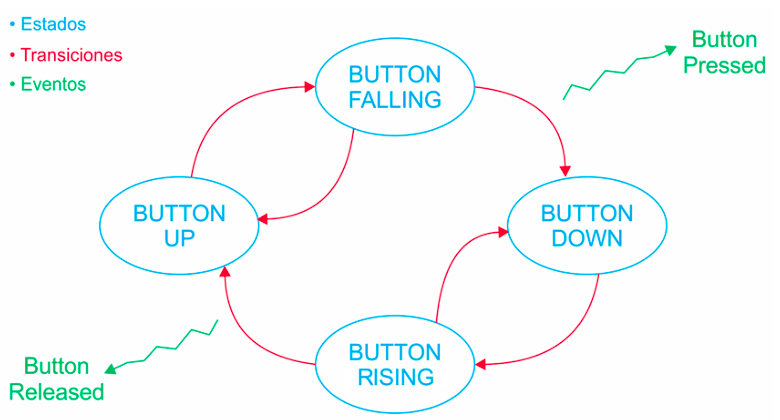

# Práctica 4

## Objetivo

Implementar una Máquina de Estados Finita (MEF) para trabajar con anti-rebotes por software.

### Punto 1 (4.1)

1. **Crear un nuevo proyecto** como copia del proyecto realizado para la práctica 3.

2. **Implementar una MEF anti-rebote** que permita leer el estado del pulsador de la placa NUCLEO-F4 y generar acciones o eventos ante un flanco descendente o ascendente, de acuerdo al siguiente diagrama:

    

   - Los estados son los siguientes:

   ```c
    typedef enum{
        BUTTON_UP,
        BUTTON_FALLING,
        BUTTON_DOWN,
        BUTTON_RAISING,
    } debounceState_t
    ```
    
    El estado inicial de la MEF debe ser `BUTTON_UP`.

3. **Implementar dentro de `main.c`, las funciones:**

   - `void debounceFSM_init();` Debe cargar el estado inicial.
   - `void debounceFSM_update();` Debe leer las entradas, resolver la lógica de transición de estados y actualizar las salidas.
   - `void buttonPressed();` Debe encender el LED.
   - `void buttonReleased();` Debe apagar el LED.

4. El **tiempo** de anti-rebote debe ser de **40 ms** con un retardo no bloqueante como los implementados en la práctica 3.

5. La función `debounceFSM_update()` debe llamarse periódicamente.