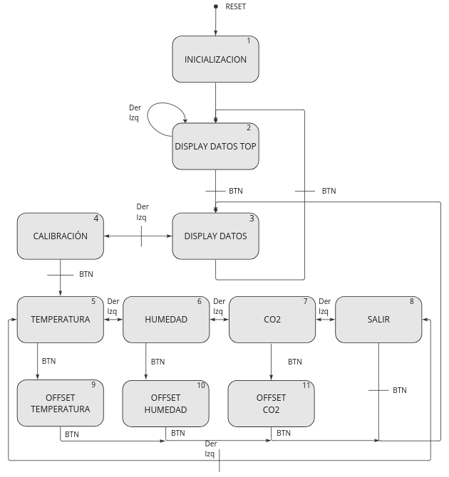

# API_ambientMonitor Library Documentation

## Overview

This library manages the monitoring of ambient parameters such as temperature, humidity, and CO2 levels, displaying them on an LCD and allowing for calibration through a user interface. It includes initialization, display updates, and navigation through various operational states using a finite state machine (FSM).



## Constants and Macros

- `ERROR_STR`, `INITIALIZATION_STR`, etc.: Strings displayed on the UART for different states.
- `LCD_*_STR`: Corresponding strings displayed on the LCD.
- `UPDATE_DATA_INTERVAL`: Interval for updating data from sensors.

## Data Structures

### `eState`

Enumerates the states of the application FSM:
- `INITIALIZATION`: System initialization.
- `DISPLAY_DATA_TOP`, `DISPLAY_DATA`: Display states.
- `CALIBRATION`: Sensor calibration mode.
- `SELECT_*`: Selection modes for temperature, humidity, CO2.
- `EXIT`: Exit the current state.
- `OFFSET_*`: Adjust offset for sensor data.

### `strFSM`

Holds the current state of the FSM:
- `state_`: Current state from `eState`.

## Functions

### `bool_t AMB_MON_Init()`

Initializes the ambient monitoring system. Sets up necessary hardware interfaces and enters the initialization state. Returns `true` if initialization is successful.

### `void AMB_MON_Update(eMovingDir dir, bool_t swPressed)`

Handles the state transitions and actions based on user inputs from an encoder and switch. Updates the display and sensor data according to the current state.

## Usage

To use this library:
1. Call `AMB_MON_Init()` to initialize the system.
2. Regularly call `AMB_MON_Update()` with the direction of encoder movement and switch press status to navigate through the UI and update data.

## Integration

- This module integrates functionalities from `API_lcd`, `API_uart`, `API_scd4x`, and `API_delay` libraries to perform its operations.
- It controls the LCD for data display and uses UART for debug messages.

## Example

Here is a brief example of how to use the ambient monitor library in an application loop:

```c

DBN_FSMinit(&swButton,  &Encoder_SW,  &swDelay);
ENC_setGPIOs(&Encoder_DT, &Encoder_CLK);
ENC_encoderInit();

if (!AMB_MON_Init()) 
{
    // Handle initialization error
}

while (true) 
{
    ENC_encoderUpdate();
    eMovingDir dir = ENC_getDirection();
    DBN_FSMupdate(&swButton);
    bool_t swPressed = DBN_readKey(&swButton);
    AMB_MON_Update(dir, swPressed);
}
```
## Notes
- Ensure that all dependent libraries (API_lcd, API_scd4x, etc.) are properly initialized before using this library.
- Adjust `UPDATE_DATA_INTERVAL` based on the desired responsiveness and sensor polling rate.