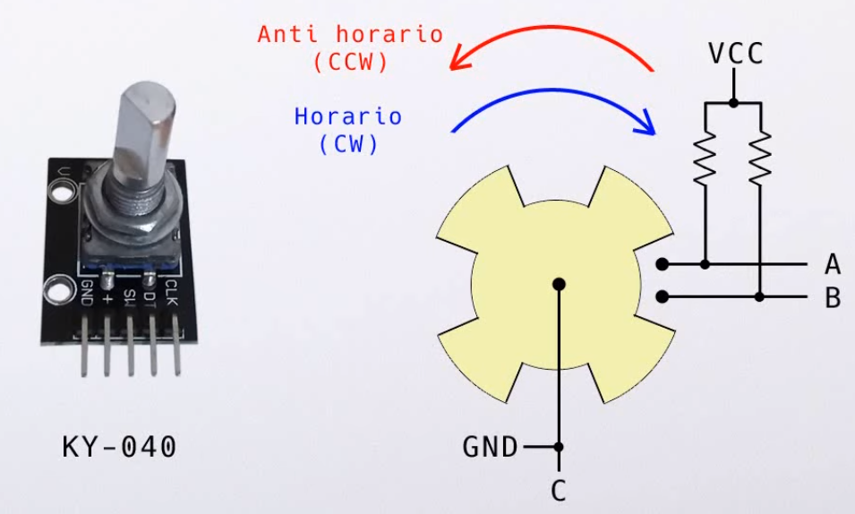
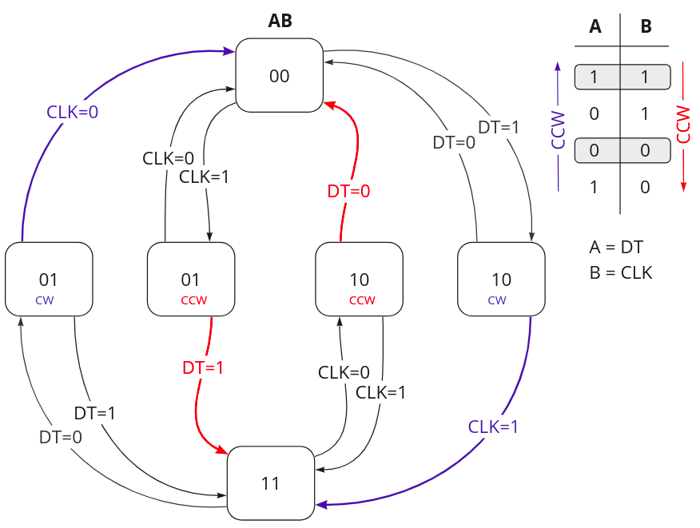

# API_encoder Library Documentation

## Overview

This library is designed for interfacing with a rotary encoder through GPIO pins, using debouncing and a finite state machine (FSM) to accurately determine the direction of rotation. It supports the detection of clockwise (CW) and counter-clockwise (CounterCW) movements.




## Constants and Macros

- `State_00`, `State_01`, `State_11`, `State_10`: States of the encoder FSM representing different combinations of the digital signals from the encoder's pins.
- `CW`, `CounterCW`, `INVALID`: Enumerations for the direction of rotation, where `INVALID` indicates no movement or an unresolved state.

## Data Structures

### `eStateEncoder`

Enumerates the states of the encoder based on the signals from DT and CLK pins.

### `stEncoder`

Holds the encoder configuration and state:
- `dt_`, `clk_`: `gpio_t` structures representing the DT and CLK GPIO configurations.
- `lastValidState_`: Last valid state detected by the FSM.
- `state_`: Current state of the FSM.
- `dir_`: Current direction of rotation.
- `taken_`: Flag to indicate if the direction has been taken or acknowledged by the application.

## Functions

### `void ENC_encoderInit()`

Initializes the encoder by setting up GPIO pin configurations and debouncing mechanisms. Sets the initial state of the FSM based on the current status of the encoder pins.

### `void ENC_encoderUpdate()`

Updates the encoder state by reading the DT and CLK pins and transitioning the FSM accordingly. This function should be called frequently to ensure accurate detection of the encoder's direction.

### `eMovingDir ENC_getDirection()`

Returns the last detected direction of the encoder's rotation (`CW` or `CounterCW`). After the direction is read, it resets the direction to `INVALID` until a new direction is determined.

### `bool_t ENC_setGPIOs(gpio_t *dt, gpio_t *clk)`

Sets the GPIO configurations for the DT and CLK pins of the encoder. Returns `true` if the pins are successfully set, otherwise `false`.

## Usage

To use this library:
1. Initialize the encoder with `ENC_encoderInit()`.
2. Continuously call `ENC_encoderUpdate()` in your main loop to process the encoder's state changes.
3. Retrieve the rotation direction using `ENC_getDirection()` when needed.

## Example

Here is a basic example of how to integrate this library into an application:

```c
ENC_setGPIOs(&dt_gpio, &clk_gpio);
ENC_encoderInit();

while (true) {
    ENC_encoderUpdate();
    eMovingDir dir = ENC_getDirection();

    if (dir != INVALID) {
        // Process direction (e.g., adjust a variable or trigger an event)
    }
}
```
## Integration
- This module relies on `API_delay` and `API_gpio` for handling delays and GPIO interactions, respectively.
- Ensure that the GPIO and delay libraries are properly initialized before using the encoder library.

## Notes
- Proper debouncing is crucial for reliable operation. Adjust debouncing settings as necessary depending on your specific hardware setup.