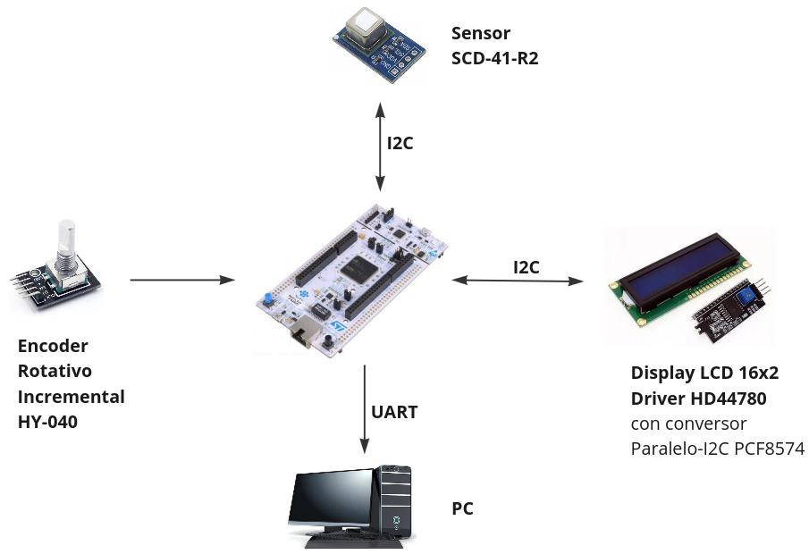
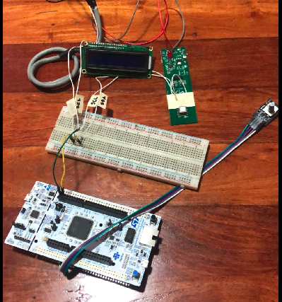

# Trabajo Práctico Final - Monitor de Ambiente

Este proyecto es el trabajo práctico final para las asignaturas PdM y PCSE. Implementa un sistema de monitoreo de ambiente utilizando una placa NUCLEO F429ZI para medir y mostrar la temperatura, humedad y niveles de CO2 en tiempo real. El sistema incluye un menú de usuario para calibración y ajuste de offsets de las mediciones, así como un trace de la máquina de estados finitos a través de la UART3.

## Características

- **Medición de temperatura, humedad y CO2**: Utiliza un sensor SCD41 para obtener mediciones precisas del ambiente.
- **Display de resultados**: Muestra las mediciones en tiempo real a través de un display LCD 16x2 HD44780 con un módulo conversor PCF8574 para conexión I2C.
- **Menú de calibración**: Permite a los usuarios ajustar el offset de las mediciones para calibrar los sensores.
- **Trace de la máquina de estados**: Utiliza la UART3, conectada al ST-Link, para enviar registros de debug y seguimiento del estado del sistema.

## Hardware

### Componentes Principales

- **Placa de desarrollo**: NUCLEO F429ZI.
- **Sensor de ambiente**: Sensirion SCD41.
- **Display LCD**: 16x2 HD44780 con módulo I2C PCF8574.
- **Encoder rotativo**: HY-040, utilizado para la navegación en el menú del usuario.

### Conexiones

- **Sensor SCD41 y display LCD**: Conectados al mismo bus I2C en los pines PB8 y PB9 (I2C_A_SCL y I2C_A_SDA).
- **UART3**: Conectada al puerto ST-Link para el trace de la máquina de estados.

## Software

### APIs Utilizadas

- `API_ambientMonitor`: Gestiona la lógica del menú y la visualización de datos.
- `API_encoder`: Maneja la entrada del usuario a través del encoder rotativo HY-040.
- `API_scd4x`: Encargada de la comunicación con el sensor SCD41.
- `API_lcd`: Controla la visualización de información en el LCD.
- Otras APIs para manejo de temporización y comunicación periférica.

## Presentaciones

- [Presentacion-PdM](./Docs/Presentacion-PdM.pdf)
- [Presentacion-PCSE](./Docs/Presentacion-PCSE.pdf)

## Links

- [Demostración Monitor Ambiente](https://drive.google.com/file/d/1c6Spt7LK5JwAIFcHeT-6YWO50yyMYHFK/view?usp=drive_link)
- [Demostración TRACE por UART](https://drive.google.com/file/d/1jQVafHF2vWL_g4ZWpDJu-ALKsj6rms3a/view?usp=drive_link)

## Documentación

- [Documentación API Ambient Monitor](./Docs/Ambient-Monitor.md)
- [Documentación API Encoder](./Docs/Encoder.md)
- [Documentación API SCD4x](./Docs/SCD4x.md)
- [Documentación API LCD](./Docs/LCD.md)
- [Documentación API UART](./Docs/UART.md)
  
## Reconocimiento

Quiero agradecer tanto a Patricio Bos como a Israel Pavelek por habernos hecho la cursada muy amena e interesante. Ha sido muy satisfactorio tanto el cursado como de la realización del trabajo práctico final.

## Autor

Iván Podoroska